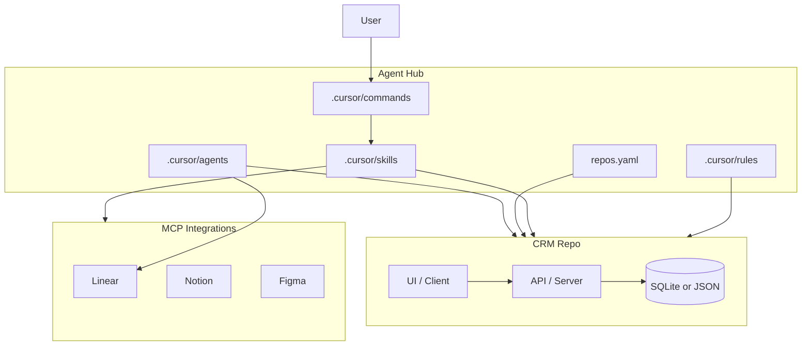

# Architecture — Agent Hub + CRM PoC

This sandbox separates **agent configuration** from **product code** to rehearse a multi-repo agent hub before production rollout.

## Repositories

| Key | Folder | Purpose |
|-----|--------|---------|
| `hub` | `agent-hub-sandbox` | Rules, skills, commands, repo map, MCP docs |
| `crm` | `parent-hub-sandbox` | Full-stack CRM app (contacts, companies, deals) |

Paths are defined in `repos.yaml`. Override locally with `repos.local.yaml` (gitignored).

## Conceptual model

## Roles = commands + skills

Roles are **not** separate subagents. Each slash command loads role rules and relevant skills:

| Command | Role | Primary output |
|---------|------|----------------|
| `/pm` | Product | Notion specs, AC, status |
| `/fullstack` | Engineering | Code + tests in CRM |
| `/frontend` | Engineering | UI in CRM |
| `/qa` | Quality | Test plans, regression, bugs |

## Subagents (task-specific only)

| Agent | Purpose |
|-------|---------|
| `repo-explorer` | Read-only CRM structure map |
| `linear-triage` | Backlog prioritization in Linear |

Use Cursor Task subagents (`explore`, `shell`) for parallel repo exploration — not role clones.

## Session flow

1. Open `sandbox-crm.code-workspace` (both folders).
2. Run a role command (`/fullstack`, etc.).
3. Agent reads `repos.yaml` → works in CRM repo.
4. MCP tools connect specs (Notion), work (Linear), and design (Figma).

## Boundaries

- **No app runtime code** in the hub repo.
- **No production repo references** in this sandbox.
- **No secrets** in git — use `.env.example` and local MCP auth.
